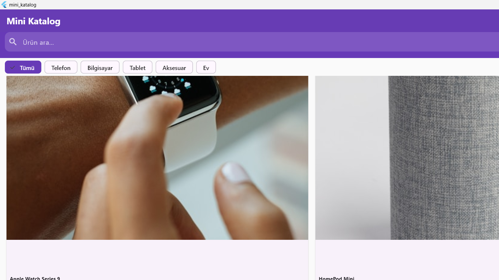

# Mini Katalog Uygulaması

Flutter ile geliştirilmiş Apple ürünleri kataloğu uygulaması.

## Ekran Görüntüleri

| Ana Sayfa |
|-----------|
|  |

## Özellikler

- **Ürün Listeleme** — 6 Apple ürünü GridView ile listelenir
- **Arama** — Ürün adına göre anlık arama/filtreleme
- **Kategori Filtresi** — Telefon, Bilgisayar, Tablet, Aksesuar, Ev
- **Ürün Detayı** — Fotoğraf, açıklama ve fiyat
- **Sepet** — Ürün ekleme, silme (swipe veya buton), sipariş onayı
- **Favoriler** — Kalp ikonu ile favorileme, ayrı ekran

## Kullanılan Teknolojiler

- Flutter 3.x / Dart 3.x
- Material Design 3
- StatefulWidget / setState
- Navigator (push/pop)
- GridView.builder / ListView.builder
- Local Assets (Image.asset)

## Ekranlar

| Ekran | Açıklama |
|-------|----------|
| `HomeScreen` | GridView ürün listesi, arama, kategori filtresi |
| `DetailScreen` | Ürün detayı, favorileme, sepete ekle |
| `CartScreen` | Sepet listesi, swipe to delete, sipariş onayı |
| `FavoritesScreen` | Favori ürünler listesi |

## Çalıştırma

```bash
flutter pub get
flutter run -d windows
```

## Proje Yapısı

```
lib/
├── main.dart
├── models/
│   └── product.dart
├── screens/
│   ├── home_screen.dart
│   ├── detail_screen.dart
│   ├── cart_screen.dart
│   └── favorites_screen.dart
└── widgets/
    └── product_card.dart
```
