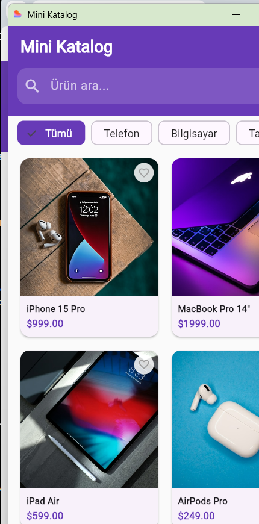
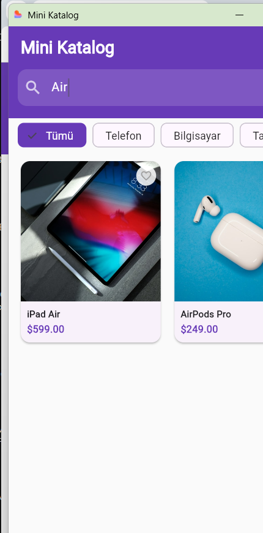
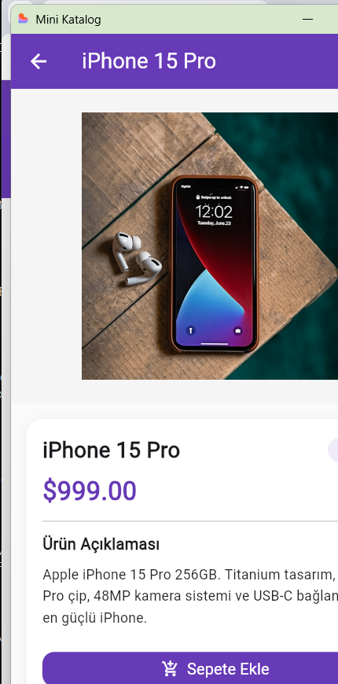
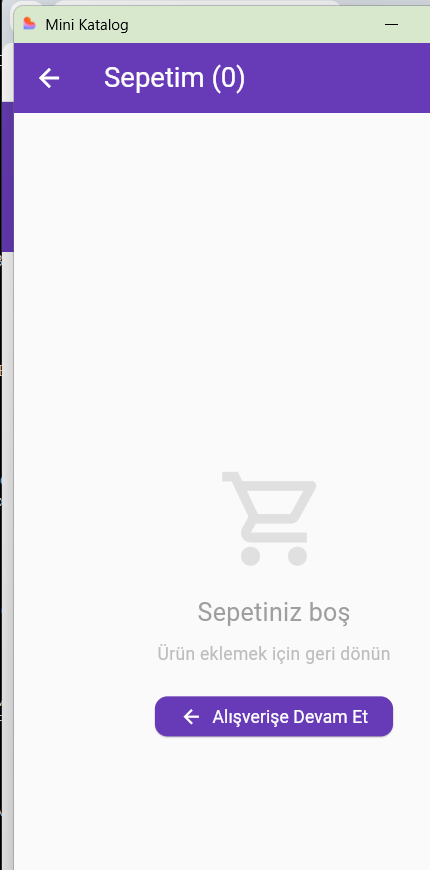

# Mini Katalog Uygulaması 🛍️

Flutter ile geliştirilmiş **Apple ürünleri** kataloğu mobil uygulaması. Kullanıcılar ürünleri listeleyebilir, arama yapabilir, kategoriye göre filtreleyebilir, favorileyebilir ve sepete ekleyebilir.

---

## 📸 Ekran Görüntüleri

| Ana Sayfa | Arama | Ürün Detayı | Sepet |
|-----------|-------|-------------|-------|
|  |  |  |  |

---

## ✨ Özellikler

### Ürün Listeleme
- 6 Apple ürünü **2 sütunlu GridView** ile listelenir
- Her kart; ürün görseli, adı ve fiyatı gösterir
- Ürün görselleri yüksek kaliteli yerel asset olarak saklanır

### Arama & Filtreleme
- Anlık arama — yazarken liste güncellenir
- **Kategori chip'leri** ile filtreleme: Tümü / Telefon / Bilgisayar / Tablet / Aksesuar / Ev

### Ürün Detayı
- Tam ekran ürün görseli
- Ürün adı, fiyatı ve açıklaması
- **Sepete Ekle** butonu — eklenince rengi yeşile döner
- AppBar'dan **favorileme** (kalp ikonu)

### Sepet
- Eklenen ürünlerin listesi
- **Sola kaydırarak** (swipe) veya çöp kutusu butonu ile silme
- Toplam fiyat hesaplama
- **Sipariş Onay** diyaloğu

### Favoriler
- Kalp ikonuna dokunarak ürün favorilenir
- AppBar'daki kalp ikonunda badge sayacı
- Ayrı **Favoriler ekranı** — favorilenen ürünler listelenir
- Favori ekrandan direkt sepete ekleme

---

## 🏗️ Proje Yapısı

```
mini_katalog/
├── lib/
│   ├── main.dart                    # Uygulama giriş noktası
│   ├── models/
│   │   └── product.dart             # Ürün veri modeli
│   ├── screens/
│   │   ├── home_screen.dart         # Ana sayfa (grid, arama, kategoriler)
│   │   ├── detail_screen.dart       # Ürün detay sayfası
│   │   ├── cart_screen.dart         # Sepet sayfası
│   │   └── favorites_screen.dart    # Favoriler sayfası
│   └── widgets/
│       └── product_card.dart        # Yeniden kullanılabilir ürün kartı
├── assets/
│   └── images/                      # Yerel ürün görselleri
│       ├── iphone.jpg
│       ├── macbook.jpg
│       ├── ipad.jpg
│       ├── airpods.jpg
│       ├── applewatch.jpg
│       └── homepod.jpg
├── screenshots/                     # Uygulama ekran görüntüleri
└── pubspec.yaml
```

---

## 🛠️ Kullanılan Teknolojiler

| Teknoloji | Açıklama |
|-----------|----------|
| Flutter 3.x | UI framework |
| Dart 3.x | Programlama dili |
| Material Design 3 | Tasarım sistemi |
| StatefulWidget / setState | Durum yönetimi |
| Navigator | Sayfa geçişleri |
| GridView.builder | Ürün ızgarası |
| ListView.builder | Sepet listesi |
| Dismissible | Kaydırarak silme |
| Image.asset | Yerel görsel yükleme |

---

## 📱 Ekranlar

| Ekran | Widget Türü | Açıklama |
|-------|-------------|----------|
| `HomeScreen` | StatefulWidget | Ürün grid, arama, kategori filtresi, badge'li ikonlar |
| `DetailScreen` | StatefulWidget | Ürün detayı, favorileme, sepete ekleme animasyonu |
| `CartScreen` | StatefulWidget | Ürün listesi, swipe-to-delete, sipariş onayı |
| `FavoritesScreen` | StatefulWidget | Favori ürünler, anlık kaldırma |

---

## 🚀 Kurulum ve Çalıştırma

### Gereksinimler
- Flutter SDK 3.0+
- Dart SDK 3.0+

### Adımlar

```bash
# 1. Bağımlılıkları yükle
flutter pub get

# 2. Windows'ta çalıştır
flutter run -d windows

# 3. Web tarayıcısında çalıştır
flutter run -d chrome
```

---

## 📦 Ürünler

| # | Ürün | Kategori | Fiyat |
|---|------|----------|-------|
| 1 | iPhone 15 Pro | Telefon | $999.00 |
| 2 | MacBook Pro 14" | Bilgisayar | $1999.00 |
| 3 | iPad Air | Tablet | $599.00 |
| 4 | AirPods Pro | Aksesuar | $249.00 |
| 5 | Apple Watch Series 9 | Aksesuar | $399.00 |
| 6 | HomePod Mini | Ev | $99.00 |
